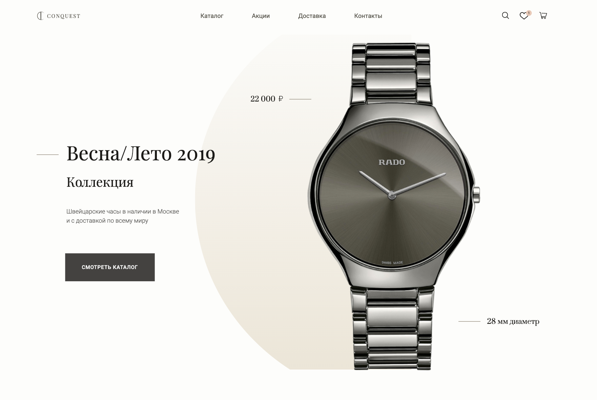
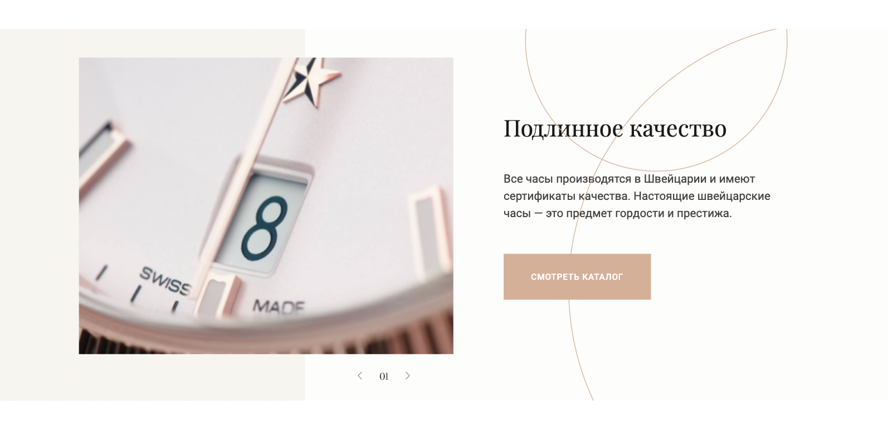
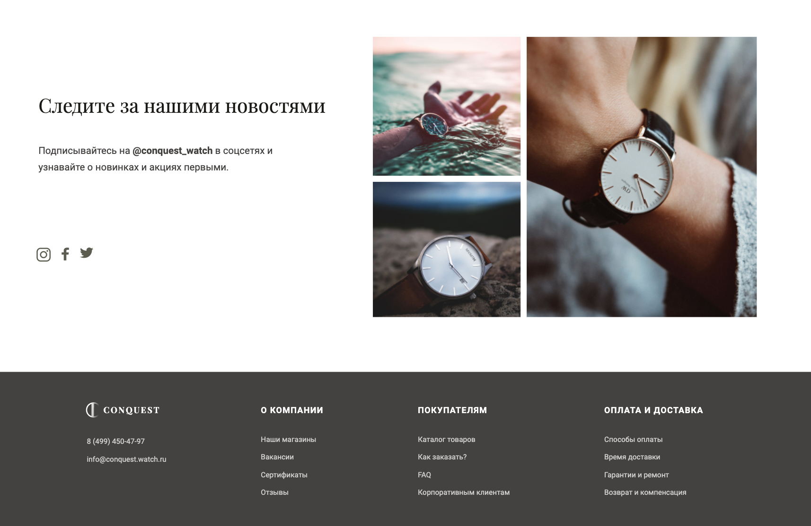

Вёрстка Макета в учебных целях
============
Магазин часов Conquest
--------------

------------
### Использовано:
* HTML5
* SASS
* Flexbox
* Webpack
* Figma
____________

### Установка и запуск:
* `npm ci`
* `npm run build`
* `npm run serve`

____________

___________
### Рефакторинг:
- [ ] Добавить линтер
- [ ] Задействовать больше возможностей SCSS
  - [ ] Переменные
  - [ ] Расширение
- [ ] Добавить Адаптивность

